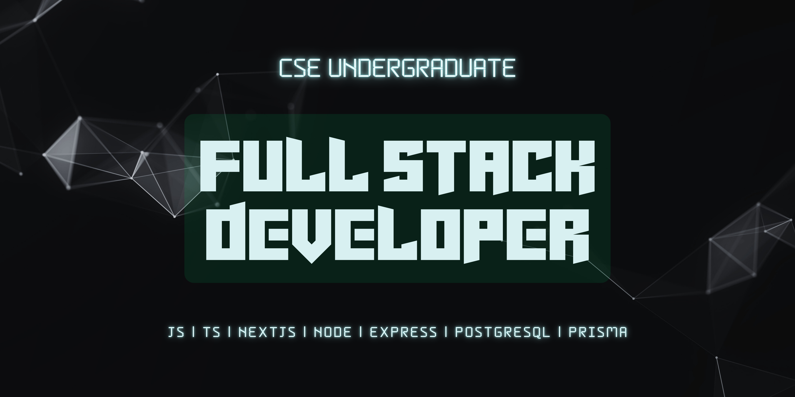

  

  <h1>Hi, Myself Mustakim (Rafid)</h1>
  
Full Stack Web Engineer | TypeScript • Next.js • Node.js • Express.js • PostgreSQL • Prisma ORM • MongoDB

---

## 💼 What I Do
- 🌱 I build full stack applications with **React, Next.js, Tailwind, Express & Node.js**
- 💻 I architect scalable systems using **PostgreSQL, Prisma ORM & MongoDB**
- ⚙️ Strong foundation in **HTML, CSS, JavaScript & TypeScript**
- 📚 University courses in **C, C++, Python** (algorithms/data structures focus)

---
## 📊 My GitHub Activity

---

## 🚀 Featured Projects

> *These are some of my most polished or meaningful projects.*

### 👇 Web Applications
- 🔗 **[Local Guide](https://tour-management-local-guide.vercel.app)** — Local Guide | Tour Management System - A full-featured healthcare system built with Next.js, Node, Express, PostgreSQL and Prisma  
- 🔗 **[AI-Powered HealthCare System](https://health-care-system-frontend-eight.vercel.app)** — A full-featured AI-powered healthcare system built with Next.js, Node, Express, PostgreSQL and Prisma  

---

## 🛠️ Tech Stack

### Frontend

### Backend & Database

### Languages & Tools

---

## 📫 Contact Me

📧 **mustakimrafid126@gmail.com**  
🌐 **Portfolio:** https://mustakim-rafid.vercel.app

---

## 🤝 Open to

- 🤔 Collaborations on interesting web apps  
- 💼 Full-Time remote job  
- 🔗 Mentorship, speaking, Learning.

---

  _“Code with clarity, build with purpose and solve real problems.”_ 🚀

